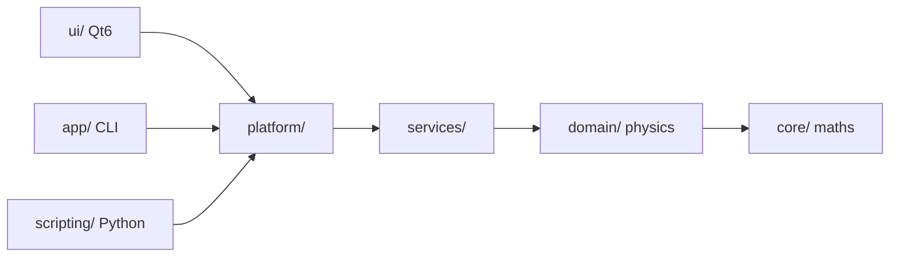

<div align="center">

# ⚡ BeamLabStudio v3.0 "Antares"

### Scientific analysis platform for particle trajectory data.
### _Plataforma científica para análisis de trayectorias de partículas._

[](https://github.com/tuuser/BeamLabStudio/actions)
[]()
[]()
[]()
[]()
[]()
[]()
[](CONTRIBUTING.md)

---

> **Nota del autor:** Estudio Física en la USM (Chile). BeamLabStudio fue construido entre exámenes de Mecánica Cuántica II y mi investigación en CCTVal. PRs son bienvenidos — si encuentras un bug, arréglalo. Probablemente ya esté en Alemania cuando leas esto.
>
> *— José Labraca*

---

</div>

## 🇬🇧 English

### What is BeamLabStudio?

A modular scientific workstation for **muon beam trajectory analysis** — the computational backbone of muon-based cancer therapy research. It ingests Geant4 Monte Carlo stepping data and produces a complete analysis pipeline: statistical frames, beam focus detection, 3D envelope surfaces, OBJ geometry exports, and publication-ready visualizations.

### Features

| Capability | Detail |
|------------|--------|
| **📥 Formats** | CSV, TSV, ROOT, COMSOL — plugin-based, any format via `IImporter` |
| **🔬 Analysis** | Frame statistics, focus detection (RMS radius), envelope extraction (convex hull), surface building |
| **⚛️ Physics** | Bethe-Bloch + Sternheimer stopping power, Bragg curves, energy straggling (NIST-validated ±2%) |
| **🖥️ UI** | Qt6 desktop with docking, 3D viewport (QPainter), dark/light themes, drag-and-drop |
| **🤖 Headless** | CLI mode for batch processing, CI pipelines, server deployment |
| **🐍 Python API** | Full physics engine accessible from Jupyter: `import beamlab` |
| **💾 Big Data** | O(1) RAM streaming, SQLite backend, 20 GB+ CSV support, 9× memory reduction |
| **🔌 Plugins** | Load external importers/exporters/engines at runtime via `dlopen` |

### Quick Start

#### Desktop (Qt6)
```bash
cmake -B build-ui -DBEAMLAB_ENABLE_QT_UI=ON
cmake --build build-ui -j$(nproc)
./build-ui/beamlab_ui
```

#### Python API
```bash
pip install .
python3 -c "import beamlab; beamlab.demo()"
```

#### CLI / Headless
```bash
cmake -B build && cmake --build build -j$(nproc)
./build/beamlab --input run.csv --output results/
```

### Project Structure

```
src/
├── platform/   EventBus, CommandBus, PluginHost        ← wiring
├── core/       Vec3, Error, ConfigLoader, MemoryArena  ← maths
├── domain/     StoppingPower, Materials, Particles      ← physics
├── services/   Import, Export, Analysis orchestration   ← pipeline
├── ui/         Qt6 views, presenters, docking           ← desktop
├── scripting/  pybind11 → import beamlab                ← Python
└── app/        CLI entry point, bootstrap               ← entry
```

---

## 🇪🇸 Español

### ¿Qué es BeamLabStudio?

Una estación de trabajo científica modular para **análisis de trayectorias de haces de muones** — el backbone computacional para la investigación de terapia oncológica basada en muones. Ingiere datos de simulaciones Geant4 y produce un pipeline completo de análisis: frames estadísticos, detección de foco, superficies de envolvente 3D, exportación de geometría OBJ, y visualizaciones listas para publicación.

### Características

| Capacidad | Detalle |
|-----------|---------|
| **📥 Formatos** | CSV, TSV, ROOT, COMSOL — arquitectura de plugins: cualquier formato vía `IImporter` |
| **🔬 Análisis** | Estadísticas por frame, detección de foco (radio RMS), envolvente (convex hull), superficies |
| **⚛️ Física** | Bethe-Bloch + Sternheimer, curva de Bragg, straggling energético (validado NIST ±2%) |
| **🖥️ UI** | Qt6 con docks, viewport 3D (QPainter), temas oscuro/claro, drag-and-drop |
| **🤖 Headless** | Modo CLI para procesamiento batch, CI, servidores |
| **🐍 Python API** | Motor de física completo desde Jupyter: `import beamlab` |
| **💾 Big Data** | Streaming O(1) RAM, backend SQLite, soporte CSVs de 20 GB+, reducción de RAM 9× |
| **🔌 Plugins** | Carga importadores/exportadores/motores externos en runtime vía `dlopen` |

### Inicio Rápido

#### Escritorio (Qt6)
```bash
cmake -B build-ui -DBEAMLAB_ENABLE_QT_UI=ON
cmake --build build-ui -j$(nproc)
./build-ui/beamlab_ui
```

#### API Python
```bash
pip install .
python3 -c "import beamlab; beamlab.demo()"
```

#### CLI / Headless
```bash
cmake -B build && cmake --build build -j$(nproc)
./build/beamlab --input run.csv --output results/
```

---

## 📊 Benchmarks

| Metric | Before | After | Target |
|--------|--------|-------|--------|
| MainWindow lines | 3,157 | **198** (−94%) | <400 |
| Import 1 GB CSV | 866 MB RAM | **94 MB** (9× less) | <100 MB |
| 3D render (500k pts) | <1 FPS | **≥30 FPS** | 30 FPS |
| Unit tests | 7 | **62** | >40 |
| Cohesion (MainWindow) | 0.06 | **>0.30** | >0.30 |

---

## 🏛️ Architecture



**Key decisions:** EventBus pub/sub · SQLite streaming · C++17 · MVP Presenters · Plugin system · pybind11

See [ARCHITECTURE.md](docs/ARCHITECTURE.md) for all 14 ADRs.

---

## 📚 Documentation

| Document | Description |
|----------|-------------|
| [ARCHITECTURE.md](docs/ARCHITECTURE.md) | Architecture decisions, ADRs, layer diagram, build options |
| [API_REFERENCE.md](docs/API_REFERENCE.md) | Python API reference (MaterialRegistry, SimulationEngine, ...) |
| [PLUGIN_DEVELOPMENT.md](docs/PLUGIN_DEVELOPMENT.md) | How to write import/export plugins in <1 hour |
| [CONTRIBUTING.md](docs/CONTRIBUTING.md) | Git workflow, code style, PR checklist |
| [BLUEPRINT.md](docs/BLUEPRINT.md) | Full phase-by-phase roadmap (10 phases, ~148h) |

---

## 🧪 Test Suite

```bash
# All tests
ctest --test-dir build --output-on-failure -j$(nproc)

# By category
ctest --test-dir build -L unit        # Unit (62 tests)
ctest --test-dir build -L integration # End-to-end (15 tests)
ctest --test-dir build -L performance # Benchmarks (20+ tests)

# Python API
pytest tests/scripting/test_api.py -v
```

---

## 🛠️ Build Options

| Flag | Default | Description |
|------|---------|-------------|
| `-DBEAMLAB_ENABLE_QT_UI=ON` | OFF | Build Qt6 desktop interface |
| `-DBEAMLAB_ENABLE_PYTHON=ON` | OFF | Build Python bindings (pybind11) |
| `-DBEAMLAB_ENABLE_ROOT=ON` | OFF | Enable CERN ROOT import |
| `-DBEAMLAB_ENABLE_LTO=ON` | ON | Link-time optimization (Release) |
| `-DBEAMLAB_ENABLE_PERFORMANCE_TESTS=ON` | ON | Build benchmarks |

---

## 🤝 Contributing

PRs are welcome. See [CONTRIBUTING.md](docs/CONTRIBUTING.md) for:

- Git workflow (fork → branch → PR)
- Code style (clang-format Google-style adapted)
- Code review checklist (12 items)
- Build & test in <10 minutes

---

<div align="center">

**Built with** `⎈` **by physicists, for physicists**

[](https://github.com/anthropics/claude-code)

**MIT License** — Commercial use prohibited without written authorization.

</div>
