# BeamLabStudio Architecture

> **Version:** 3.0.0 "Antares"
> **Status:** Active development
> **License:** MIT (commercial use prohibited)

---

## Overview

BeamLabStudio is a modular scientific platform for muon beam trajectory analysis.
It operates in three modes:

| Mode | Entry | Dependencies | Use case |
|------|-------|--------------|----------|
| **Desktop** | `beamlab_ui` | Qt6, OpenGL | Interactive analysis with 3D viewport |
| **CLI / Headless** | `beamlab` | none | Batch processing, server-side, CI |
| **Embedded** | `import beamlab` | pybind11 | Jupyter notebooks, scripting, automation |

---

## Layer Diagram

```mermaid
graph TB
    subgraph "Application"
        APP[app/] --> UI[ui/qt]
        APP --> CLI[app/ main.cpp]
    end

    subgraph "Python"
        PY[scripting/] --> PY11[pybind11]
        PY11 --> SRV
    end

    subgraph "Platform"
        PLAT[platform/]
        PLAT --> EB[EventBus]
        PLAT --> CB[CommandBus]
        PLAT --> PH[PluginHost]
        PLAT --> SR[ServiceRegistry]
    end

    subgraph "Services"
        SRV[services/]
        SRV --> IM[import/]
        SRV --> EX[export/]
        SRV --> AN[analysis/]
        SRV --> ST[storage/]
    end

    subgraph "Domain"
        DOM[domain/]
        DOM --> PHY[physics/]
        DOM --> MAT[materials/]
        DOM --> GEO[geometry/]
        DOM --> SIM[simulation/]
    end

    subgraph "Core"
        COR[core/]
        COR --> MATH[math/]
        COR --> CFG[config/]
        COR --> FDN[foundation/]
    end

    APP --> PLAT
    APP --> SRV
    CLI --> SRV
    UI --> SRV
    SRV --> DOM
    SRV --> PLAT
    DOM --> COR
    COR --> MATH

    style APP fill:#2a1a3a,stroke:#9c27b0
    style PY fill:#1a3a2a,stroke:#2e7d32
    style PLAT fill:#1a1a3a,stroke:#3949ab
    style SRV fill:#1a3a3a,stroke:#00bcd4
    style DOM fill:#3a2a1a,stroke:#ef6c00
    style COR fill:#3a1a1a,stroke:#c62828
```



---

## Directory Structure

```
src/
├── platform/          EventBus, CommandBus, PluginHost, ServiceRegistry
├── core/              Vec3, Error, ConfigLoader, MemoryArena
├── domain/            Physics, Materials, Geometry, Simulation
├── data/              TrajectorySample, AxisFrame, repositories
├── services/          Import, Export, Analysis (orchestration), Storage
│   ├── import/        ImporterRegistry, Geant4CsvImporter, COMSOL...
│   ├── export/        ExporterRegistry, CsvExporter, ObjExporter...
│   ├── analysis/      Orchestrator, JobScheduler, engines
│   └── storage/       IStorageBackend, SqliteBackend, StorageManager, QueryCache
├── io/                Legacy import/export (being migrated to services/)
├── analysis/          Legacy analysis engines (being migrated to services/)
├── app/               ApplicationBootstrap, CLI entry point
├── ui/                Qt6 widgets, Views, Presenters, DockManager
│   ├── qt/            MainWindow, Scene3DWidget, styles
│   ├── views/         AnalysisView, BioSimView, ExportView
│   └── presenters/    AnalysisPresenter, BioSimPresenter, ExportPresenter
└── scripting/         pybind11 module, __init__.py, Jupyter examples
```

---

## Dependency Flow

```
     ┌──────────────────────────────┐
     │        beamlab_ui (Qt6)       │
     │  MainWindow, Views, Presenters│
     └────────────┬─────────────────┘
                  │
     ┌────────────▼─────────────────┐
     │       beamlab_platform        │
     │  EventBus, CommandBus, Plugin  │
     │  Host, ServiceRegistry        │
     └────────────┬─────────────────┘
                  │
     ┌────────────▼─────────────────┐
     │    beamlab_services           │
     │  import/, export/, analysis/, │
     │  storage/                     │
     └────────────┬─────────────────┘
                  │
     ┌────────────▼─────────────────┐
     │       beamlab_domain          │
     │  physics/, materials/,        │
     │  geometry/, simulation/       │
     └────────────┬─────────────────┘
                  │
     ┌────────────▼─────────────────┐
     │        beamlab_core           │
     │  math/, config/, foundation/  │
     └──────────────────────────────┘
```

Each layer depends only on layers below it. No circular dependencies.

---

## Key Architecture Decisions (ADRs)

| ID | Decision | Rationale | Phase |
|----|----------|-----------|-------|
| ADR-001 | **EventBus** pub/sub | Desacopla módulos que no deberían conocerse entre sí | F1 |
| ADR-002 | **PluginHost** con `.so`/`.dll` | Permite distribución separada sin recompilar core | F1 |
| ADR-003 | **CQRS** (CommandBus + QueryBus) | Separa lecturas cacheables de escrituras. Facilita undo/redo futuro | F1 |
| ADR-004 | **SQLite** como storage primario | Battle-tested para billones de filas, B-tree gratis, header-only | F2 |
| ADR-005 | **C++17** (no C++20) | C++20 no agrega features críticas y podría romper CI | F2 |
| ADR-006 | **Profile system** (JSON multi-capa) | Permite quick/full/clinical modos sin cambiar código | F1 |
| ADR-007 | **MVP Presenter** sobre MVC/MVVM | Qt ya tiene Model/View nativo. Presenter es más ligero | F6 |
| ADR-008 | **pybind11** para Python API | Moderno, header-only, compatible con C++17 | F9 |
| ADR-009 | **MemoryArena** para batch processing | Elimina fragmentación O(1) reset en loops críticos | F7 |
| ADR-010 | **GitHub Actions CI** | Gratuito para repo público, matrix gcc/clang | F8 |
| ADR-011 | **Domain Unification** `biosim/` → `domain/` | Cohesión 0.06 → >0.30, sin Qt, sin singletons | F4 |
| ADR-012 | **Registry Pattern** (`unordered_map`) | Búsqueda O(1) vs O(N), built-in vs custom separados | F4 |
| ADR-013 | **SimulationEngine** fachada | Unifica 4 clases dispersas en una API de alto nivel | F4 |
| ADR-014 | **UI/Domain Separation** | Views no conocen Domain. Solo Presenters inyectados | F4 |

---

## Patrones de Diseño

| Patrón | Dónde | Propósito |
|--------|-------|-----------|
| **Strategy** | `IStorageBackend` → `InMemoryBackend` / `SqliteBackend` | Backend seleccionado según tamaño del archivo |
| **Presenter (MVP)** | `AnalysisPresenter` entre View y Services | La Vista no conoce el Modelo |
| **Factory Method** | `IStorageBackend::create(fileSize)` | Decide qué backend instanciar |
| **Observer** | `ProgressTracker` → callbacks a Presenter | Pipeline emite progreso sin conocer Qt |
| **Facade** | `SimulationEngine` | Unifica 4 engines de física en una API |
| **Dependency Injection** | Constructores reciben registries por referencia | Testable con mocks |
| **RAII** | `BatchGuard`, `SharedLibHandle`, `PipelineGuard` | Cleanup automático en excepciones |
| **LRU Cache** | `QueryCache` (list + unordered_map) | Acelera consultas SQL repetitivas |
| **Double Buffering** | `Scene3DWidget::cachedPixmap_` | Renderiza offscreen, blit O(1) en paintEvent |

---

## Threading Model

```
Main Thread (Qt)              Worker Threads
─────────────────              ─────────────────
MainWindow                    AnalysisOrchestrator::executePipeline()
  └─ Views                       ├─ import()           ← std::thread
      └─ Presenters              ├─ JobScheduler::     ← ThreadPool(N)
          └─ QMetaObject::          runAll()
              invokeMethod()      │  └─ EngineA::      ← pool thread 1
              (QueuedConnection)   │  └─ EngineB::      ← pool thread 2
                                   │  └─ EngineC::      ← pool thread 3
                                   └─ exportAll()      ← std::thread
```

Callbacks from worker threads are marshalled to the main thread via
`QMetaObject::invokeMethod(this, lambda, Qt::QueuedConnection)`.

Services never include `<QObject>` or `<QWidget>`.

---

## Build

```bash
# Dependencies: cmake 3.20+, g++/clang++, Qt6 (optional)

# Debug — all modes
cmake -B build -DBEAMLAB_ENABLE_QT_UI=ON -DBEAMLAB_ENABLE_PYTHON=ON
cmake --build build -j$(nproc)

# Release — headless only
cmake -B build-release -DCMAKE_BUILD_TYPE=Release
cmake --build build-release -j$(nproc)

# Tests
ctest --test-dir build --output-on-failure -L unit

# Python bindings
export PYTHONPATH="$PWD/build/python:$PYTHONPATH"
python3 -c "import beamlab; beamlab.demo()"
```

### Build Options

| Flag | Default | Description |
|------|---------|-------------|
| `BEAMLAB_ENABLE_QT_UI` | OFF | Build Qt6 desktop UI |
| `BEAMLAB_ENABLE_ROOT` | OFF | CERN ROOT file import |
| `BEAMLAB_ENABLE_PYTHON` | OFF | Python bindings (pybind11) |
| `BEAMLAB_ENABLE_PERFORMANCE_TESTS` | ON | Performance benchmarks |
| `BEAMLAB_ENABLE_LTO` | ON | Link-time optimisation (Release) |
| `BEAMLAB_ENABLE_NATIVE_ARCH` | OFF | `-march=native` |

### Targets

| Target | Type | Description |
|--------|------|-------------|
| `beamlab_core` | STATIC | Math, config, foundation |
| `beamlab_domain` | STATIC | Physics, materials, geometry, simulation |
| `beamlab_platform` | STATIC | EventBus, CommandBus, PluginHost |
| `beamlab_services_import` | STATIC | IImporter, format detection, registries |
| `beamlab_services_export` | STATIC | IExporter, CSV/OBJ/Parquet exporters |
| `beamlab_services_analysis` | STATIC | Orchestrator, JobScheduler, storage backends |
| `beamlab_ui` | EXECUTABLE | Qt6 desktop application |
| `beamlab` | EXECUTABLE | CLI / headless mode |
| `pybeamlab` | MODULE | Python `.so` (named `_core`) |
| `beamlab_tests` | EXECUTABLE | Unit tests |
| `beamlab_integration_tests` | EXECUTABLE | Integration tests |
| `beamlab_performance_tests` | EXECUTABLE | Benchmarks |

---

## Performance Targets

| KPI | Target | Measured |
|-----|--------|----------|
| Scene3D FPS (500k points) | ≥30 FPS | ___ |
| Import 1 GB CSV | <15 s | ___ |
| RAM 20 GB dataset | <1 GB | ___ |
| Query cache hit rate | >80% | ___ |
| Arena alloc vs malloc | 90% reduction | ___ |
| Speedup 4 cores (stats) | >2.5× | ___ |

---

## Metrics (Phase Goals)

| Metric | Pre-F4 | Post-F6 | Target |
|--------|--------|---------|--------|
| `MainWindow.cpp` lines | 3,157 | 198 | <400 |
| `MainWindow.h` lines | 226 | 73 | <100 |
| Cohesion BioMaterial (C1) | 0.06 | — | >0.30 |
| Community cohesion <0.10 | 4 | — | 0 |
| Weakly-connected nodes | 237 | — | <20 |
| Unit tests | 7 | 62 | >40 |
| Integration tests | 0 | 15 | >4 |

---

## References

- **Blueprint:** `BLUEPRINT.md` — full phase-by-phase plan
- **Plugin dev:** `PLUGIN_DEVELOPMENT.md` — how to write import plugins
- **API reference:** `API_REFERENCE.md` — Python API docs
- **Contributing:** `CONTRIBUTING.md` — git workflow, code style, PR checklist
- **Checklists:** `docs/checklist_fase*.md` — phase-specific validation
