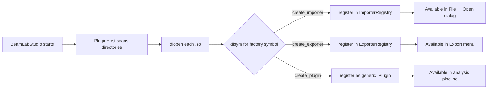

# BeamLabStudio Plugin Development Guide

> **Build your own data format, exporter, or analysis engine — without touching the core.**

---

## 1. Overview

BeamLabStudio's architecture is built around plugins.  Every data format reader, every export format, and every analysis engine is a **plugin** that implements one of these interfaces:

| Plugin Type | Interface | Symbol | Example |
|-------------|-----------|--------|---------|
| **Importer** | `IImporter` | `create_importer()` | Geant4 CSV, COMSOL, ROOT |
| **Exporter** | `IExporter` | `create_exporter()` | CSV, OBJ, Parquet (future: PNG, PDF) |
| **Analysis Engine** | `IAnalysisEngine` | `create_plugin()` | FrameStatistics, FocusDetector |
| **Visualization Engine** | `IPlugin` + custom | `create_plugin()` | Future: VTK, OpenGL |
| **Material Provider** | `IPlugin` | `create_plugin()` | Future: custom ICRU materials |

Plugins are **shared libraries** (.so / .dylib / .dll) that BeamLabStudio loads at runtime via `dlopen()` / `LoadLibrary()`.  No recompilation of the core is needed.

### Discovery flow



---

## 2. Prerequisites

- **C++17** compiler (GCC 9+, Clang 12+, MSVC 2019+)
- **CMake 3.20+**
- **BeamLabStudio SDK** — either:
  - A built copy of BeamLabStudio (`build-ui/` directory with compiled targets), or
  - An installed SDK (`/usr/local/include/beamlab/` headers + `.cmake` config)
- **Linux** (`.so`), **macOS** (`.dylib`), or **Windows** (`.dll`)

Verify your environment:

```bash
c++ --version
cmake --version
ls /path/to/BeamLabStudio/build-ui/libbeamlab_*.a   # SDK libraries
```

---

## 3. Quick Start — Importer Plugin (15 minutes)

This guide creates a plugin that recognises a custom binary format with magic bytes `MYF`.

### Step 1: Copy the Template

```bash
cp -r /path/to/BeamLabStudio/src/plugins/importers/template/ ~/my_importer
cd ~/my_importer
```

### Step 2: Rename Files and Classes

```bash
mv ExampleImporter.h   MyFormatImporter.h
mv ExampleImporter.cpp MyFormatImporter.cpp
```

Edit `MyFormatImporter.h`:

```cpp
#pragma once
#include <beamlab/services/import/IImporter.h>

namespace beamlab::plugins {

class MyFormatImporter final : public services::import::IImporter {
public:
    std::string name() const override { return "MyFormat"; }

    std::vector<std::string> supportedExtensions() const override {
        return {".myf", ".mydata"};
    }

    services::import::ImporterCapabilityScore probe(
        const std::string& filePath) override;

    void import(const std::string& filePath,
                services::storage::IStorageBackend& storage,
                services::import::ImportProgressCallback onProgress) override;
};

} // namespace beamlab::plugins
```

### Step 3: Implement `probe()`

Edit `MyFormatImporter.cpp` — replace the magic number check:

```cpp
services::import::ImporterCapabilityScore
MyFormatImporter::probe(const std::string& filePath)
{
    services::import::ImporterCapabilityScore result;

    std::ifstream file(filePath, std::ios::binary);
    if (!file.is_open()) return result;

    char magic[4] = {0};
    file.read(magic, 4);

    if (std::memcmp(magic, "MYF\x01", 4) == 0) {
        result.value = 1.0;
        result.matchedHeader = "MYF v1 magic bytes";
    }

    return result;
}
```

### Step 4: Implement `import()`

```cpp
void MyFormatImporter::import(
    const std::string& filePath,
    services::storage::IStorageBackend& storage,
    services::import::ImportProgressCallback onProgress)
{
    namespace fs = std::filesystem;

    auto fileSize = fs::file_size(filePath);
    std::ifstream file(filePath, std::ios::binary);

    if (!file.is_open())
        throw std::runtime_error("Cannot open: " + filePath);

    // Skip header / magic bytes (4 bytes).
    file.seekg(4);

    storage.beginWriteBatch();
    struct BatchGuard {
        services::storage::IStorageBackend& b;
        bool committed = false;
        ~BatchGuard() { if (!committed) { try { b.endWriteBatch(); } catch (...) {} } }
    };
    BatchGuard guard{storage};

    uint64_t sampleCount = 0;

    while (file) {
        // Read one record: trajectory_id(uint64), x(double), y(double), z(double)
        beamlab::data::TrajectorySample sample;
        file.read(reinterpret_cast<char*>(&sample.trajectory_id), sizeof(uint64_t));
        file.read(reinterpret_cast<char*>(&sample.position_m.x), sizeof(double));
        file.read(reinterpret_cast<char*>(&sample.position_m.y), sizeof(double));
        file.read(reinterpret_cast<char*>(&sample.position_m.z), sizeof(double));

        if (!file) break;  // EOF or read error

        storage.writeSample(sample);
        ++sampleCount;

        if (sampleCount % 100000 == 0 && onProgress) {
            auto pos = static_cast<uint64_t>(file.tellg());
            onProgress(pos, fileSize);
        }
    }

    guard.committed = true;
    storage.endWriteBatch();
    if (onProgress) onProgress(fileSize, fileSize);
}
```

### Step 5: Update `CMakeLists.txt`

Edit the project name and source files:

```cmake
project(MyFormatImporterPlugin VERSION 1.0.0 LANGUAGES CXX)
# ...
add_library(my_importer SHARED MyFormatImporter.cpp)
# ...
install(TARGETS my_importer LIBRARY DESTINATION importers)
```

### Step 6: Build

```bash
export BEAMLAB_SDK_DIR=/path/to/BeamLabStudio/build-ui
mkdir build && cd build
cmake .. -DCMAKE_PREFIX_PATH=$BEAMLAB_SDK_DIR
cmake --build .
```

### Step 7: Install

```bash
cmake --install . --prefix ~/.config/BeamLabStudio/plugins
# Or manually:
cp libmy_importer.so ~/.config/BeamLabStudio/plugins/importers/
```

### Step 8: Verify

```bash
ls ~/.config/BeamLabStudio/plugins/importers/libmy_importer.so
nm -D ~/.config/BeamLabStudio/plugins/importers/libmy_importer.so | grep create_importer
```

Launch BeamLabStudio, open a `.myf` file — the importer is auto-detected.

---

## 4. `IImporter` Interface — Detailed Reference

```cpp
// File: <beamlab/services/import/IImporter.h>
namespace beamlab::services::import {

class IImporter {
public:
    virtual ~IImporter() = default;

    // ── Identity (used in UI and logs) ────────────────────────────
    virtual std::string name() const = 0;

    // ── File extensions for dialog filtering ──────────────────────
    // Return all extensions this importer can handle.
    // Example: {".csv", ".tsv"}
    virtual std::vector<std::string> supportedExtensions() const = 0;

    // ── Format detection ─────────────────────────────────────────
    // Read the first few bytes/rows of the file and return a score
    // indicating how confident we are that this is our format.
    //
    // Scoring guidelines:
    //   1.0  — exact magic bytes match
    //   0.9  — exact header text match
    //   0.7  — column headers match expected names
    //   0.5  — structural clues (e.g. looks like CSV with 5 cols)
    //   0.3  — extension-only match (weak evidence)
    //   0.0  — definitely not our format
    virtual ImporterCapabilityScore probe(const std::string& filePath) = 0;

    // ── Data import ──────────────────────────────────────────────
    // Read the file, parse samples, and write them into the storage
    // backend.  Called after probe() has confirmed the format.
    //
    // Requirements:
    //   1. Call storage.beginWriteBatch() before the first write.
    //   2. Call storage.endWriteBatch() after the last write.
    //   3. Use RAII (scope guard) to ensure endWriteBatch() is
    //      called even if an exception is thrown.
    //   4. Call onProgress() periodically so the UI stays responsive.
    virtual void import(const std::string& filePath,
                        storage::IStorageBackend& storage,
                        ImportProgressCallback onProgress) = 0;
};

// ── Helper types ─────────────────────────────────────────────────

struct ImporterCapabilityScore {
    double value{0.0};          // 0.0–1.0
    std::string matchedHeader;  // For debugging
};

// Progress callback signature:
using ImportProgressCallback = std::function<void(
    uint64_t bytesRead,    // Bytes processed so far
    uint64_t totalBytes     // Total file size (0 if unknown)
)>;

} // namespace beamlab::services::import
```

### Common `probe()` patterns

| Pattern | Code | Score |
|---------|------|-------|
| Magic bytes | `file.read(magic, 4); if (magic == "MYF1")` | 1.0 |
| Text header | `getline(file, line); if (line.find("BEGIN_DATA") == 0)` | 0.9 |
| Column headers | Split first line, compare with expected names | 0.7 |
| Numeric content | Parse first data line, check `stod()` success rate | 0.5 |
| Extension-only | Check `filePath` ends with `.myf` | 0.3 |

### RAII guard pattern (required)

Always wrap your import loop with a scope guard:

```cpp
storage.beginWriteBatch();
struct Guard {
    IStorageBackend& b;
    bool committed = false;
    ~Guard() { if (!committed) { try { b.endWriteBatch(); } catch (...) {} } }
};
Guard guard{storage};

// ... parsing loop ...

guard.committed = true;
storage.endWriteBatch();
```

Without this guard, an exception during parsing leaves the backend in an
inconsistent state (open transaction, leaked memory, locked database).

---

## 5. `IExporter` Interface — Detailed Reference

```cpp
// File: <beamlab/services/export/IExporter.h>
namespace beamlab::services::export_ {

class IExporter {
public:
    virtual ~IExporter() = default;

    virtual std::string name() const = 0;       // "CSV Exporter"
    virtual std::string format() const = 0;     // "csv"
    virtual std::vector<std::string> fileExtensions() const = 0; // {".csv"}

    virtual ExportResult exportData(
        const storage::IStorageBackend& storage,
        const analysis::AnalysisResult& result,
        const std::filesystem::path& outputPath,
        ExportProgressCallback onProgress = nullptr) = 0;
};

struct ExportResult {
    bool success{false};
    std::optional<std::string> error;
    std::filesystem::path outputPath;
    uint64_t bytesWritten{0};
};

using ExportProgressCallback = std::function<void(
    float percent,           // 0.0–1.0
    const std::string& stage // "Writing vertices", "Compressing", ...
)>;

} // namespace beamlab::services::export_
```

### CsvExporter (reference implementation)

See `src/services/export/CsvExporter.cpp` for a complete example that:
1. Reads `result.engineResults[].metrics["frames_data"]` for frame statistics
2. Writes a CSV with header row + data rows
3. Reports progress from 0.0 → 1.0
4. Returns `bytesWritten` from `std::filesystem::file_size()`

---

## 6. `IAnalysisEngine` Interface — Reference

See `docs/ARCHITECTURE.md`, section **3.2 Interfaz IAnalysisEngine** for the full API.

Key methods:

| Method | Purpose |
|--------|---------|
| `name()` | Return `"MyEngine"` |
| `version()` | Return `"1.0.0"` |
| `requiresBinnedData()` | `true` if engine needs pre-binned histograms |
| `estimatedMemoryBytes(n)` | Upper bound on RAM for `n` samples |
| `execute(storage, config, progress)` | Main computation — reads from `IStorageBackend` |
| `validateConfig(config)` | Check `nlohmann::json` config for required keys |

### Execution contract

1. Engine reads samples via `storage.readBatch(offset, count)` — never via `TrajectoryDataset`.
2. Engine checks `cancelled_` flag between batches.
3. Engine returns `EngineResult::ok(metrics)` or `EngineResult::fail(error)`.
4. Metrics are JSON: `{{"frames", 42}, {"total_samples", 100000}}`.

---

## 7. Debugging

### Enable verbose plugin logging

```bash
export BEAMLAB_PLUGINS_DEBUG=1
./beamlab_ui 2>&1 | grep -i plugin
```

Expected output:
```
[PluginHost] Loaded: MyFormat v1.0.0
[PluginHost] Initialized: MyFormat v1.0.0
```

### Check that the .so exports the right symbol

```bash
nm -D ~/.config/BeamLabStudio/plugins/importers/libmy_importer.so | grep create_
```

| Expected symbol | Plugin type |
|----------------|-------------|
| `T create_importer` | Importer plugin |
| `T create_exporter` | Exporter plugin |
| `T create_plugin` | Generic plugin (IAnalysisEngine, etc.) |

If `nm` shows no `create_*` symbol, check that:
- The function is declared `extern "C"` (not inside `extern "C++"`)
- The function has `__attribute__((visibility("default")))`
- The `CMakeLists.txt` sets `set(CMAKE_CXX_VISIBILITY_PRESET hidden)` and you used `-fvisibility=hidden`

### Verify .so dependencies

```bash
ldd ~/.config/BeamLabStudio/plugins/importers/libmy_importer.so
```

All unresolved symbols should be resolvable from BeamLabStudio's own libraries.
If you see `not found`, the plugin was compiled against a different SDK version
than the running application.

### Common errors

| Symptom | Cause | Fix |
|---------|-------|-----|
| Plugin not listed in UI | `create_importer` symbol missing | Run `nm -D`, check `extern "C"` |
| `dlopen` fails with "undefined symbol" | Plugin links different SDK version | Rebuild with same `$BEAMLAB_SDK_DIR` |
| `segfault` on import | Missing `beginWriteBatch()` call | Add `storage.beginWriteBatch()` |
| Progress bar stuck at 0% | `onProgress` never called | Call `onProgress(bytesRead, fileSize)` |
| "No suitable importer" | `probe()` returned score < 0.2 | Check magic bytes / header logic |
| `LoadingPlugin` failed silently | `create_*()` returned `nullptr` | Always return a valid pointer from factory |

---

## 8. Distribution

Package your plugin for other users:

```
my-format-importer-v1.0.0/
├── libmy_importer.so         # Compiled shared library
├── libmy_importer.dylib      # macOS variant
├── libmy_importer.dll        # Windows variant (optional)
├── plugin.json               # Plugin manifest
├── README.md                 # Description + usage
└── example_data/             # Small test file
```

### Plugin manifest (`plugin.json`)

```json
{
  "name": "MyFormat Importer",
  "version": "1.0.0",
  "type": "importer",
  "description": "Reads MyExperiment binary format (.myf)",
  "author": "Your Name",
  "sdk_version": "0.1.0",
  "extensions": [".myf", ".mydata"],
  "homepage": "https://github.com/you/my-importer"
}
```

### Installation by end users

```bash
# User installs to their config directory
cp libmy_importer.so ~/.config/BeamLabStudio/plugins/importers/

# Or system-wide (requires root)
sudo cp libmy_importer.so /usr/local/share/BeamLabStudio/plugins/importers/
```

---

## 9. SDK API Reference

### Classes your plugin can use

| Class | Header | Purpose |
|-------|--------|---------|
| `beamlab::services::import::IImporter` | `<beamlab/services/import/IImporter.h>` | Interface your importer implements |
| `beamlab::services::export_::IExporter` | `<beamlab/services/export/IExporter.h>` | Interface your exporter implements |
| `beamlab::domain::simulation::SimulationEngine` | `<beamlab/domain/simulation/SimulationEngine.h>` | Physics calculations (dE/dx, Bragg) |
| `beamlab::services::storage::IStorageBackend` | `<beamlab/services/storage/IStorageBackend.h>` | Backend you read/write samples from/to |
| `beamlab::data::TrajectorySample` | `<beamlab/data/model/TrajectorySample.h>` | Sample struct |
| `beamlab::data::TrajectoryId` | `<beamlab/data/ids/TrajectoryId.h>` | Strongly-typed trajectory ID |
| `beamlab::services::import::ImporterCapabilityScore` | `<beamlab/services/import/IImporter.h>` | Probe result struct |
| `nlohmann::json` | `<nlohmann/json.hpp>` | JSON for config and metrics |

### Types you do NOT use (core internals)

These classes are internal to BeamLabStudio.  Do not depend on them:

- `beamlab::core::SqliteStorage` — use `IStorageBackend` instead
- `beamlab::io::Geant4CsvImporter` — use `IImporter` interface
- `beamlab::analysis::FrameStatisticsEngine` — use `IAnalysisEngine` interface
- `QMainWindow`, `QApplication` — never use Qt in a plugin

### SDK directory structure (reference)

```
/opt/beamlab/include/beamlab/
├── services/
│   ├── import/
│   │   └── IImporter.h
│   ├── export/
│   │   └── IExporter.h
│   ├── storage/
│   │   └── IStorageBackend.h
│   └── analysis/
│       └── engines/
│           ├── IAnalysisEngine.h
│           └── EngineResult.h
├── domain/
│   ├── simulation/
│   │   └── SimulationEngine.h
│   └── materials/
│       ├── Material.h
│       └── MaterialRegistry.h
├── data/
│   ├── model/
│   │   └── TrajectorySample.h
│   └── ids/
│       └── TrajectoryId.h
└── platform/
    └── IPlugin.h
```

---

## 10. Quick Reference Card

```bash
# ── Build ────────────────────────────────────────────────────────────
export BEAMLAB_SDK_DIR=/opt/beamlab
cmake -B build -DCMAKE_PREFIX_PATH=$BEAMLAB_SDK_DIR
cmake --build build

# ── Check symbols ────────────────────────────────────────────────────
nm -D build/libmy_importer.so | grep create_

# ── Install ──────────────────────────────────────────────────────────
cp build/libmy_importer.so ~/.config/BeamLabStudio/plugins/importers/

# ── Test ──────────────────────────────────────────────────────────────
BEAMLAB_PLUGINS_DEBUG=1 ./beamlab_ui

# ── Debug ─────────────────────────────────────────────────────────────
ldd ~/.config/BeamLabStudio/plugins/importers/libmy_importer.so
nm -D ~/.config/BeamLabStudio/plugins/importers/libmy_importer.so | grep create_
```
